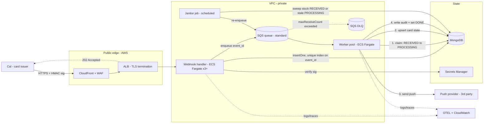
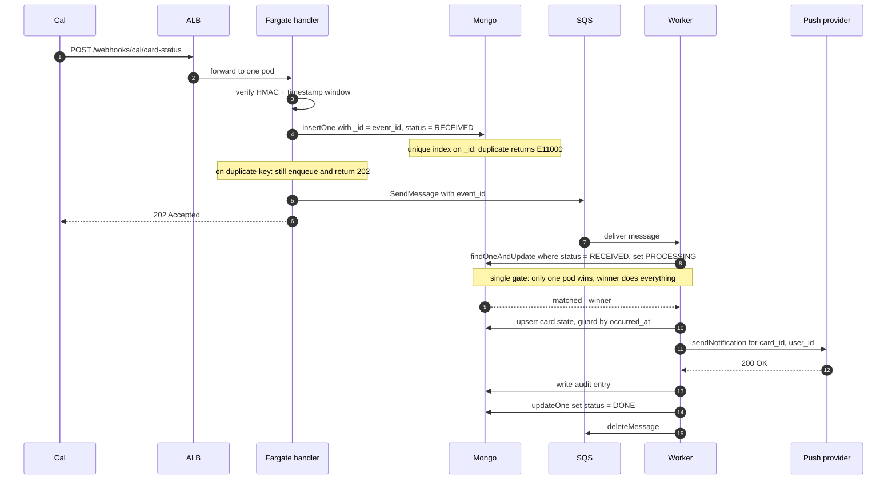
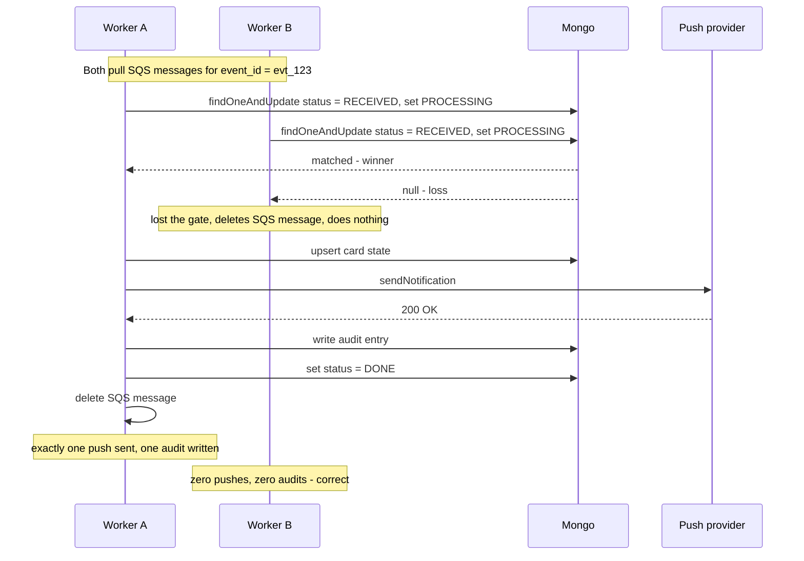
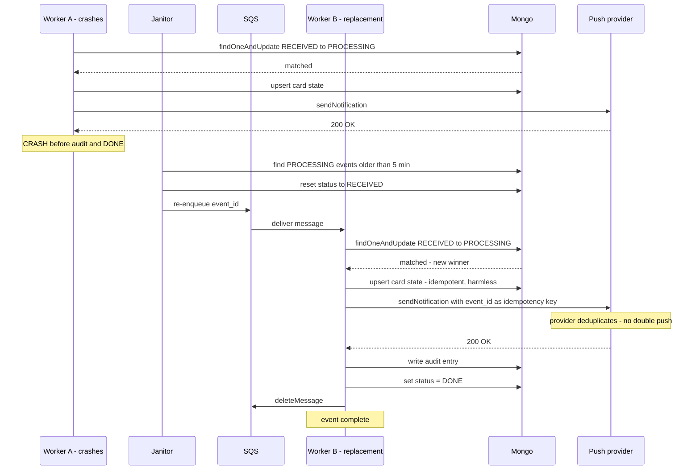

# Architecture — Cal Card-Status Webhook Ingestion

## Component view

## Request sequence — happy path

## Race resolution — two workers, same event_id

This is the critical constraint. Two workers receive SQS messages for the
same `event_id` (via Cal retry re-enqueue or SQS redelivery after visibility
timeout). The single atomic gate ensures exactly one worker performs all side
effects.

## Crash recovery — worker dies mid-processing

A worker wins the gate, sends the push, then crashes before writing the
audit. The janitor detects the stale `PROCESSING` event, resets it to
`RECEIVED`, and re-enqueues. A new worker claims it and completes the
remaining work. Push double-send is prevented by including `event_id` as an
idempotency key with the provider.

