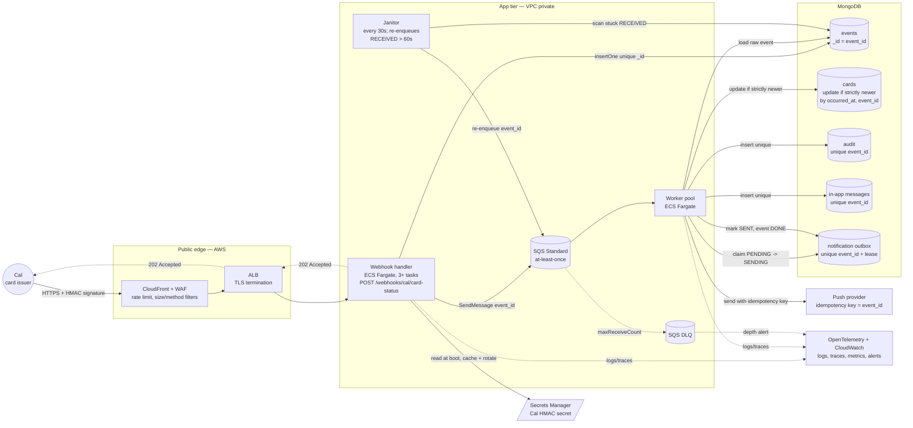
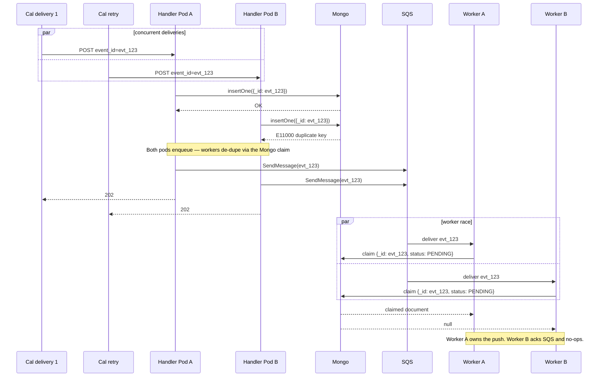

# Architecture - Cal Card-Status Webhook Ingestion

## Component view



**Notes on the diagram.** Solid arrows are request-side data flow; dotted arrows
are responses, observability fan-out, or queue-internal transitions. Secrets
Manager is intentionally drawn outside the MongoDB group — it is an AWS service,
not part of the application's persistent state. In-app messages and the
notification outbox are separate collections because they have different
lifecycles: in-app messages are insert-once, the outbox carries lease state for
the push attempt.

## Request sequence — happy path

```mermaid
sequenceDiagram
    autonumber
    participant Cal
    participant ALB
    participant Handler as Fargate handler
    participant Mongo
    participant SQS
    participant Worker
    participant Push as Push provider

    Cal->>ALB: POST /webhooks/cal/card-status<br/>X-Cal-Signature, X-Cal-Timestamp
    ALB->>Handler: forward to one pod
    Handler->>Handler: verify HMAC over raw body + timestamp window
    Handler->>Mongo: insertOne event {_id: event_id, status: RECEIVED, raw}
    Note over Mongo: unique _id makes duplicate receipt safe
    Handler->>SQS: SendMessage({event_id})
    Handler-->>ALB: 202 Accepted
    ALB-->>Cal: 202 Accepted

    SQS->>Worker: deliver event_id (at least once)
    Worker->>Mongo: load event by event_id
    Worker->>Mongo: update card if strictly newer by (occurred_at, event_id)
    Worker->>Mongo: insert audit entry, unique on event_id
    Worker->>Mongo: insert in-app message, unique on event_id
    Worker->>Mongo: claim notification outbox PENDING -> SENDING
    Note over Worker,Mongo: one worker wins the claim; duplicates get null
    Worker->>Push: sendNotification(..., idempotency_key = event_id)
    Push-->>Worker: accepted
    Worker->>Mongo: mark notification SENT, event DONE
    Worker->>SQS: deleteMessage
```

## Race resolution — duplicate deliveries and workers


