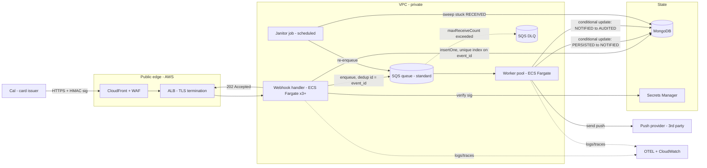
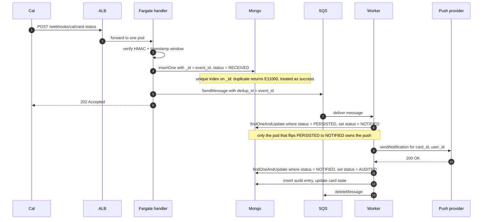
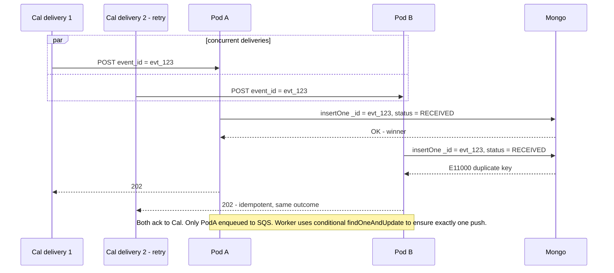

# Architecture — Cal Card-Status Webhook Ingestion

## Component view

```mermaid
flowchart LR
    Cal[Cal - card issuer]

    subgraph Edge["Public edge - AWS"]
        WAF[CloudFront + WAF]
        ALB[ALB - TLS termination]
    end

    subgraph App["VPC - private"]
        direction TB
        H[Webhook handler - ECS Fargate x3+]
        Q[(SQS queue - standard)]
        W[Worker pool - ECS Fargate]
        DLQ[(SQS DLQ)]
        JAN[Janitor job - scheduled]
    end

    subgraph Data["State"]
        M[(MongoDB)]
        SM[Secrets Manager]
    end

    PUSH[Push provider - 3rd party]
    OBS[OTEL + CloudWatch]

    Cal -->|"HTTPS + HMAC sig"| WAF
    WAF --> ALB
    ALB --> H

    H -->|"verify sig"| SM
    H -->|"insertOne, unique index on event_id"| M
    H -->|"enqueue, dedup id = event_id"| Q
    H -->|"202 Accepted"| ALB

    Q --> W
    W -->|"conditional update: PERSISTED to NOTIFIED"| M
    W -->|"send push"| PUSH
    W -->|"conditional update: NOTIFIED to AUDITED"| M
    Q -.->|"maxReceiveCount exceeded"| DLQ

    JAN -->|"sweep stuck RECEIVED"| M
    JAN -->|"re-enqueue"| Q

    H -.->|"logs/traces"| OBS
    W -.->|"logs/traces"| OBS
```

## Request sequence — happy path

```mermaid
sequenceDiagram
    autonumber
    participant Cal
    participant ALB
    participant Handler as Fargate handler
    participant Mongo
    participant SQS
    participant Worker as Worker
    participant Push as Push provider

    Cal->>ALB: POST /webhooks/cal/card-status
    ALB->>Handler: forward to one pod
    Handler->>Handler: verify HMAC + timestamp window
    Handler->>Mongo: insertOne with _id = event_id, status = RECEIVED
    Note over Mongo: unique index on _id: duplicate returns E11000, treated as success
    Handler->>SQS: SendMessage with dedup_id = event_id
    Handler-->>Cal: 202 Accepted

    SQS->>Worker: deliver message
    Worker->>Mongo: findOneAndUpdate where status = PERSISTED, set status = NOTIFIED
    Note over Worker,Mongo: only the pod that flips PERSISTED to NOTIFIED owns the push
    Worker->>Push: sendNotification for card_id, user_id
    Push-->>Worker: 200 OK
    Worker->>Mongo: findOneAndUpdate where status = NOTIFIED, set status = AUDITED
    Worker->>Mongo: insert audit entry, update card state
    Worker->>SQS: deleteMessage
```

## Race resolution — two pods, same event_id

```mermaid
sequenceDiagram
    participant CalA as Cal delivery 1
    participant CalB as Cal delivery 2 - retry
    participant PodA as Pod A
    participant PodB as Pod B
    participant Mongo

    par concurrent deliveries
        CalA->>PodA: POST event_id = evt_123
    and
        CalB->>PodB: POST event_id = evt_123
    end

    PodA->>Mongo: insertOne _id = evt_123, status = RECEIVED
    Mongo-->>PodA: OK - winner
    PodB->>Mongo: insertOne _id = evt_123, status = RECEIVED
    Mongo-->>PodB: E11000 duplicate key

    PodA-->>CalA: 202
    PodB-->>CalB: 202 - idempotent, same outcome

    Note over PodA,PodB: Both ack to Cal. Only PodA enqueued to SQS. Worker uses conditional findOneAndUpdate to ensure exactly one push.
```
