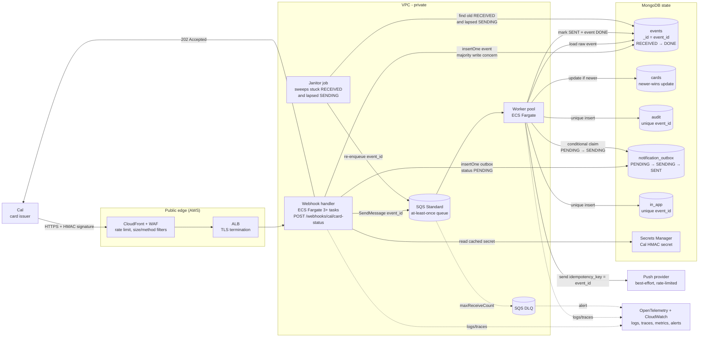
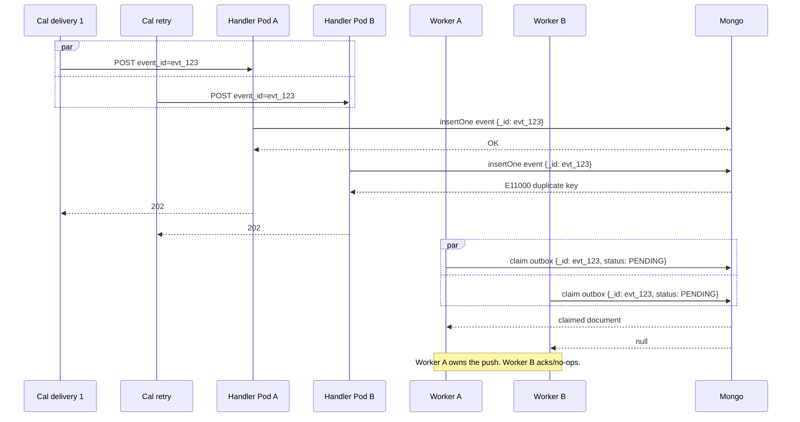

# Architecture - Cal Card-Status Webhook Ingestion

## Component view



## Request sequence - happy path

```mermaid
sequenceDiagram
    autonumber
    participant Cal
    participant ALB
    participant Handler as Fargate handler
    participant Mongo
    participant SQS
    participant Worker
    participant Push as Push provider

    Cal->>ALB: POST /webhooks/cal/card-status<br/>X-Cal-Signature, X-Cal-Timestamp
    ALB->>Handler: forward to one pod
    Handler->>Handler: verify HMAC over raw body + timestamp window
    Handler->>Mongo: insertOne event {_id: event_id, status: RECEIVED, raw}
    Note over Mongo: unique _id makes duplicate receipt safe
    Handler->>Mongo: insertOne notification_outbox {_id: event_id, status: PENDING}
    Handler->>SQS: SendMessage({event_id})
    Handler-->>Cal: 202 Accepted

    SQS->>Worker: deliver event_id at least once
    Worker->>Mongo: load event by event_id
    Worker->>Mongo: update card only if event is newer
    Worker->>Mongo: insert audit entry unique on event_id
    Worker->>Mongo: insert in-app message unique on event_id
    Worker->>Mongo: claim outbox PENDING → SENDING (conditional update)
    Note over Worker,Mongo: one worker gets the claim; duplicates get null
    Worker->>Push: sendNotification(..., idempotency_key = event_id)
    Push-->>Worker: accepted
    Worker->>Mongo: mark outbox SENT and event DONE
    Worker->>SQS: deleteMessage
```

## Race resolution - duplicate deliveries and workers


